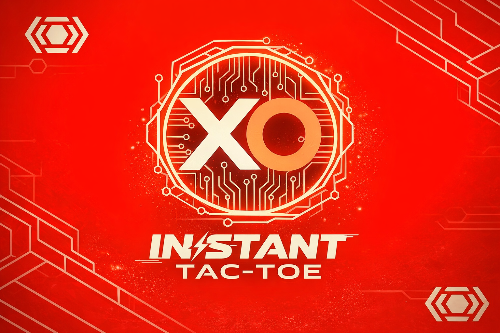

<p align="center">
  
</p>

# InstantTacToe: Real-Time On-Chain Tic-Tac-Toe ⚡

**The first truly real-time on-chain Tic-Tac-Toe experience.** Every move finalizes in **<100ms**, demonstrating the power and speed of **Linera microchains** for low-latency gaming.

Live playable demo →
Source Code → **https://github.com/girume1/instanttactoe**

[](https://linera.io/buildathon)

---

# ⚡ InstantTacToe

[](https://linera.io)
[](https://rust-lang.org)
[](https://webassembly.org)

**Real-time multiplayer Tic-Tac-Toe on Linera microchains with sub-100ms finality illusion.**

> Built for the Linera Buildathon • Neon Cyberpunk UI • On-chain game state


## ✨ Features

✅ **Real-time Gameplay** - Sub-100ms finality illusion  
✅ **Multiplayer** - Join system with turn validation  
✅ **On-chain State** - Full game state on Linera microchains  
✅ **Neon Cyberpunk UI** - Responsive, modern interface  
✅ **GraphQL API** - Complete query interface  
✅ **Linera SDK 0.15.8** - Full SDK compliance  

## 🚀 Quick Start

### Prerequisites
- [Rust](https://rustup.rs/) (1.86+)
- [Linera CLI](https://linera.io/docs/getting-started)
- [Node.js](https://nodejs.org/) (18+)
- [Git](https://git-scm.com/)

### Installation

```bash
# 1. Clone repository
git clone https://github.com/yourusername/instanttactoe.git
cd instanttactoe

# 2. Build WASM contracts
cargo build --release --target wasm32-unknown-unknown --package game

# 3. Initialize Linera wallet
linera wallet init --faucet https://faucet.testnet-conway.linera.net

# 4. Deploy to Testnet Conway
./deploy.sh
```
# Running Locally
```
# Terminal 1: Start Linera service
linera service --port 8080

# Terminal 2: Start frontend
cd frontend
npm install
npm run dev

# Open browser: http://localhost:3000
```
# 🏗️ Architecture
```
instanttactoe/
├── abi/                    # Application Binary Interface
│   └── src/lib.rs         # Contract & Service ABI definitions
├── game/                   # Core game logic
│   ├── src/lib.rs         # Main contract & service implementation
│   ├── src/state.rs       # Game state management
│   ├── src/contract.rs    # Contract entry point
│   └── src/service.rs     # Service entry point
├── frontend/              # React frontend
│   ├── pages/index.js     # Main game UI
│   └── styles/globals.css # Cyberpunk styling
└── Cargo.toml            # Rust workspace configuration
```
# 📡 GraphQL API
## Queries ##
```
# Get current game state
query {
  board {
    board
    currentPlayer
    winner
    gameStatus
  }
}
```
## Mutations (via Contract Operations) ##
```
# Join a game
mutation {
  joinGame
}

# Make a move
mutation MakeMove($position: Int!) {
  makeMove(position: $position)
}

# Reset game
mutation {
  resetGame
}
```
# 🎯 Game Flow
1. Player joins → Game status changes to IN_PROGRESS

2. Players take turns → Validated moves on-chain

3. Win detection → Game ends with winner declaration

4. Reset option → Start new game with fresh state

# 🔧 Development
## Building Contracts ##
```bash
cargo build --release --target wasm32-unknown-unknown --package game
```

# Testing
```bash
# Run Rust tests
cargo test --package game
```

# Test GraphQL endpoint
```
curl -X POST http://localhost:8080/chains/<chain-id>/applications/<app-id> \
  -H "Content-Type: application/json" \
  -d '{"query":"{ __typename }"}'
  ```

# Deployment
```bash
# Publish module
linera publish-module target/wasm32-unknown-unknown/release/game_contract.wasm \
  target/wasm32-unknown-unknown/release/game_service.wasm

# Create application instance
linera create-application <module-id>
```

# 🛠️ Tech Stack
| Layer | Technology |
| :--- | :--- |
| **Blockchain** | Linera SDK 0.15.8, Rust, WASM |
| **Frontend** | React, Next.js, Tailwind CSS |
| **API** | GraphQL, Async-GraphQL |
| **Styling** | Neon Cyberpunk theme, CSS-in-JS |
| **Tooling** | Cargo, npm, Git |

# 👥 Contributors
Name - Girum

Built for Linera Buildathon
# 🙏 Acknowledgments
-> Linera team for SDK and documentation

-> Testnet Conway validators

-> Open source community

# ⭐ Star this repo if you find it useful!

---

## 🎯 **Additional Files to Create:**

### **1. `deploy.sh` (in project root):**
```bash
#!/bin/bash
set -e

echo "🚀 Building InstantTacToe..."
cargo build --release --target wasm32-unknown-unknown --package game

echo "📦 Publishing module to Testnet Conway..."
MODULE_OUTPUT=$(linera publish-module \
  target/wasm32-unknown-unknown/release/game_contract.wasm \
  target/wasm32-unknown-unknown/release/game_service.wasm)

MODULE_ID=$(echo "$MODULE_OUTPUT" | tail -1)
echo "✅ Module ID: $MODULE_ID"

echo "🎮 Creating application..."
APP_OUTPUT=$(linera create-application "$MODULE_ID")
APP_ID=$(echo "$APP_OUTPUT" | tail -1)
echo "✅ Application ID: $APP_ID"

echo ""
echo "🎉 DEPLOYMENT COMPLETE!"
echo "========================"
echo "Module ID:    $MODULE_ID"
echo "Application ID: $APP_ID"
echo ""
echo "📡 To run:"
echo "  1. linera service --port 8080"
echo "  2. cd frontend && npm run dev"
echo "  3. Open http://localhost:3000"
echo ""
echo "🔗 GraphQL: http://localhost:8080/chains/<chain-id>/applications/$APP_ID"
```

## Built with ❤️ on Linera ##
